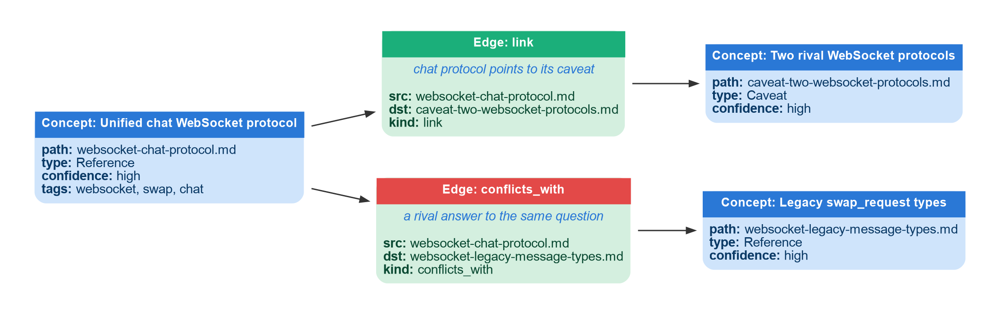
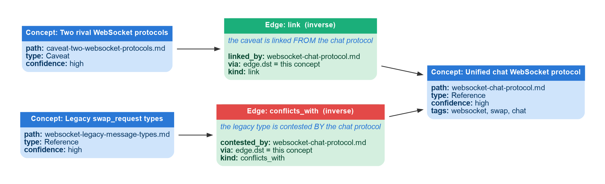
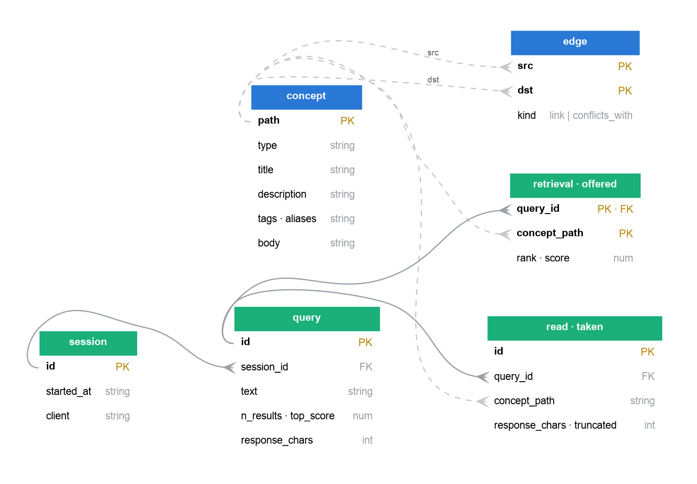

# okf-ctx

A context handler for LLMs over an [Open Knowledge Format](https://okf.md) bundle.

Your docs stay as markdown in git — the source of truth. This builds a **derived, disposable** index over them, serves them to an agent through MCP, and logs every retrieval so you can see which docs get used, which get ignored, and which questions have no answer.

No API key. No embeddings. No network.

## Install

```bash
pipx install 'okf-ctx[server]'        # recommended; `apt install pipx` first on Debian/Ubuntu
```

On Debian/Ubuntu, plain `pip install` into system Python fails with PEP 668 (`externally-managed-environment`). That's correct — use `pipx`, `uv tool install`, or a venv. Don't pass `--break-system-packages`.

Indexing and search need only PyYAML; the `[server]` extra pulls the MCP SDK's tree (~28 packages). Skip it if you only want the CLI.

## Use

```bash
okf check  --bundle ./bundle                      # validate against ingest-context.md §12
okf index  --bundle ./bundle --db ./.okf/index.db # build; unchanged files are skipped
okf search --db ./.okf/index.db rango api key     # BM25 over title/aliases/tags/description/body
okf render --bundle ./bundle --db ./.okf/index.db # fill <!-- concepts:auto --> in index.md
```

Wire the MCP server into Claude Code:

```json
{ "mcpServers": { "okf": {
    "command": "okf-serve",
    "args": ["--bundle", "/abs/path/bundle", "--db", "/abs/path/.okf/index.db"] } } }
```

That gives the agent four tools: `search`, `read`, `links`, and `report` (what's failing in the bundle).

## Workflow

The fastest start is `okf init`, which scaffolds the bundle directory, wires the MCP server into your client's config, and — for Claude Code — writes two skills/agents:

```bash
cd your-project
okf init                 # or: okf init --client cursor|codex|gemini|all
```

Then the lifecycle is two halves, **create** and **maintain**:

| Step | Claude Code | Any other client |
|---|---|---|
| **Create** the bundle from docs | `/okf-ingest` | `okf ingest` or `okf prompt` (paste) |
| Build the index | `okf index` | same |
| **Maintain** it from usage data | `/okf-curator` | `okf prompt --curate` (paste) |

`ingest-context.md` is the authoring instruction the create step follows; `okf init` copies it into the skill so it's self-contained.

**The library makes no LLM calls of its own.** The model is already on the other end of the MCP connection — `okf ingest` drives your local `claude`, and `okf prompt` / `okf prompt --curate` just print instructions for any agent to run. No second API client, no API key.

The **maintain** half is the point: `okf report` (and the `report` MCP tool) reads the usage log and names each bad concept — oversold descriptions, missing aliases, gaps, unmarked contradictions — and the curator fixes the markdown, then re-indexes. See [Telemetry](#telemetry).

## How search works

Keyword (BM25), **not semantic**. A concept is found only if the searcher's words are literally in its indexed text — nothing infers that "churn" and "attrition" are related. That is why `description`, `tags`, and `aliases` are the retrieval layer, and why `ingest-context.md` spends most of its length on how to write them.

The tradeoff is deliberate: a bad alias is a line of YAML you can read and fix. A bad embedding is a number you can't.

Field weights (descending): `title` → `aliases` → `tags` → `description` → `body`.

## When not to use this

Below roughly 30 documents, `grep` is genuinely better and you should not install this. The bundle costs a full ingestion pass to build; that only amortizes if the docs get queried repeatedly.

## Telemetry

Every MCP tool call writes to the index. The join between `retrieval` (what search offered) and `read` (what the model took) is the point — it distinguishes:

| Symptom | Signal | Diagnosis |
|---|---|---|
| Noise | high retrieval, low read | bad title/description; it's stealing traffic |
| Insufficient | read → another query, same session | the doc failed to answer |
| Gap | zero-hit query | knowledge that doesn't exist yet |
| Dead weight | never retrieved | unreachable or redundant |
| Hot + stale | many reads, old timestamp | highest-risk doc you have |

Honest limit: this observes retrieval, not whether the answer was right. A read means a doc was consulted, not that it helped.

## Data model

OKF borrows the shape of [SciTools Understand](https://www.m-zakeri.ir/OpenUnderstand/): a graph of **nodes and typed relationships**. Understand has `Entity` linked by `Reference`; OKF has `concept` linked by `edge`. The figures below use that project's presentation style, with a real slice of a bundle.



**Figure 1 — OKF data structure for a real bundle.** Blue = `concept` (the knowledge, with instance values). Green/red = `edge` (a typed relationship: `link` or `conflicts_with`). Arrows read `concept → edge → concept`, mirroring Understand's `Entity → Reference → Entity`.



**Figure 2 — the same edges in the inverse direction.** `links(path, direction="in")` walks `edge.dst` backward: what points *at* a concept. This is how a reader arriving at the chat protocol learns which concepts reference and contest it — the OKF analog of Understand's inverse (`-by`) references.

## Database schema

One SQLite file (default `.okf/index.db`, WAL mode). Canonical DDL is [`okf_ctx/schema.sql`](okf_ctx/schema.sql).



**Figure 3 — OKF database schema (core tables).** Blue = derived from the bundle (rebuilt by `okf index`). Green = telemetry (the only non-derived data). Solid arrows are enforced foreign keys; dashed are logical links via `path`, which are deliberately *not* FKs because OKF tolerates broken links. `meta`, `source_file`, and the `concept_fts` search index are omitted for clarity.

**The two halves behave completely differently, and it matters:**

| Half | Tables | Lifecycle |
|---|---|---|
| **Derived** | `meta`, `concept`, `edge`, `concept_fts` | Rebuilt from the markdown. `okf index --rebuild` **deletes and regenerates** them. Never write here — your edit is erased on the next index. Edit the markdown instead. |
| **History** | `session`, `query`, `retrieval`, `read` | The only non-derived data. Never touched by re-indexing. Delete the `.db` and this is gone for good. |

### Derived

**`concept`** — one row per non-reserved `.md` file.

| Column | Type | Notes |
|---|---|---|
| `path` | TEXT PK | bundle-relative, e.g. `auth/rotate-key.md` |
| `type` | TEXT | one of Concept, Metric, Process, Reference, Decision, System, Caveat |
| `title`, `description`, `confidence`, `timestamp` | TEXT | from frontmatter |
| `tags`, `aliases`, `source` | TEXT | **newline-joined**, not JSON — they were YAML lists |
| `body` | TEXT | markdown after the frontmatter |
| `word_count` | INTEGER | proxy for context cost. **Not tokens** — fine for ranking, not for budgeting |
| `content_hash` | TEXT | sha256 of the raw file; unchanged files skip re-indexing |
| `indexed_at` | TEXT | ISO 8601 |

**`edge`** — the link graph. PK `(src, dst, kind)`.

| Column | Notes |
|---|---|
| `src`, `dst` | concept paths. `dst` may not exist — OKF tolerates broken links as to-do markers |
| `kind` | `link` (markdown link in body) or `conflicts_with` (frontmatter; rival answers to the same question) |

**`concept_fts`** — FTS5 virtual table, `porter unicode61`. **Column order is load-bearing**: `bm25()` weights are positional, and the code passes `(10, 8, 5, 3, 1)` for `title, aliases, tags, description, body`. Reorder the columns and you silently reweight search. `path` is `UNINDEXED`.

**`meta`** — `key`/`value`. Currently one row: `bundle_path`, the absolute path the index was built from. The server refuses to start if it doesn't match the bundle it was told to serve — otherwise a stale `--db` answers this project's questions with another project's docs, silently.

### History (telemetry)

**`session`** — `id` (hex), `started_at`, `client`. One per server process; a reconnect starts a new one.

**`query`** — one row per `search()`.

| Column | Notes |
|---|---|
| `id` | INTEGER PK AUTOINCREMENT |
| `session_id`, `ts`, `text` | |
| `n_results` | `0` ⇒ knowledge gap |
| `top_score` | NULL on zero hits. Negated bm25, so **higher is better** |

**`retrieval`** — what search **offered**. PK `(query_id, concept_path)`, plus `rank`, `score`.

**`read`** — what the model **took**. `id`, `session_id`, `ts`, `concept_path`, `query_id` (NULL = opened without searching).

### The join that matters

`retrieval` and `read` are separate tables for one reason: **offered ≠ taken**. That difference is where bad context hides, and a single view-count column cannot express it.

```sql
-- concepts search keeps pushing that the model keeps refusing:
-- the description promises what the concept can't deliver
SELECT rt.concept_path, count(*) AS offered,
       sum(rd.id IS NOT NULL) AS taken
FROM retrieval rt
LEFT JOIN read rd ON rd.concept_path = rt.concept_path
                 AND rd.query_id = rt.query_id
GROUP BY rt.concept_path
HAVING taken = 0 AND offered >= 3;
```

```sql
-- read, then searched again => the doc was found and FAILED to answer.
-- Raw view counts score this as a success. Use EXISTS, not JOIN: a JOIN
-- multiplies each read by every later query in the session.
SELECT rd.concept_path, count(*) AS times
FROM read rd
WHERE EXISTS (SELECT 1 FROM query q
              WHERE q.session_id = rd.session_id AND q.id > rd.query_id)
GROUP BY rd.concept_path;
```

## License

MIT
